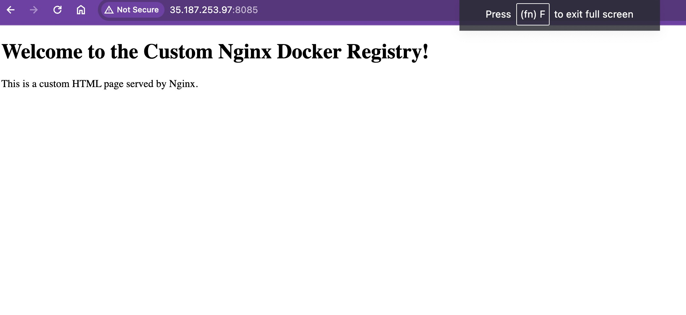

## Lab docker registry

### Step 1: Login to Docker Hub

#### Run the following command to login to Docker Hub:

```
docker login -u  yourusername 

```
```
#### Enter your password when prompted.
................................
```

### Step 2:


## Delete all containers

```
docker stop $(docker ps -a -q)  
docker rm $(docker ps -a -q) 
docker rmi $(docker images -q) 
docker volume rm $(docker volume ls -q)  
docker network prune -f
```

## display all containers and images

```
docker ps -a
docker images
```


## create directory

   
    mkdir LAB2_Week11
    cd    LAB2_Week11
    

## git clone branch dev
    
    
   ```
    git clone -b dev https://github.com/Tuchsanai/DevTools.git
     
    cd DevTools/02_Docker/Week11/02_Lab_docker_registry/
   ```


### Step 3: Build the Docker image


Build the Docker image with a custom tag using the following command:


Play with tag
```
docker build -t local_tuchsanai:1.0 .

```

 In order to push to docke registry, you need to rename (tag command) the image with format: `<docker-username>/<repository-name>:<tag>`

```
docker tag  local_tuchsanai:1.0 tuchsanai/custom-nginx-registry:2.0
```

display image

``` 
docker images
```


### Step 4: Push the Docker image to Docker Hub

```
docker push tuchsanai/custom-nginx-registry:2.0
```

** if success, you will see the following output:


###  Step 5: Stop all Container and remove all images

```
docker stop $(docker ps -a -q)  
docker rm $(docker ps -a -q) 
docker rmi $(docker images -q) 
docker volume rm $(docker volume ls -q)  
docker network prune -f
```


### Step 6: Pull the Docker image from Docker Hub

```
docker pull tuchsanai/custom-nginx-registry:2.0
```


### Step 7: Run the Docker container using the pulled image with the following command:
    
```
docker run -d -p 8085:80 tuchsanai/custom-nginx-registry:2.0
```

** if success, you will see the following output:



# Delete all containers

```
docker stop $(docker ps -a -q)  
docker rm $(docker ps -a -q) 
docker rmi $(docker images -q) 
docker volume rm $(docker volume ls -q)  
docker network prune -f
```